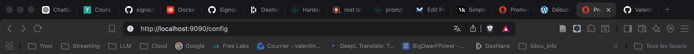
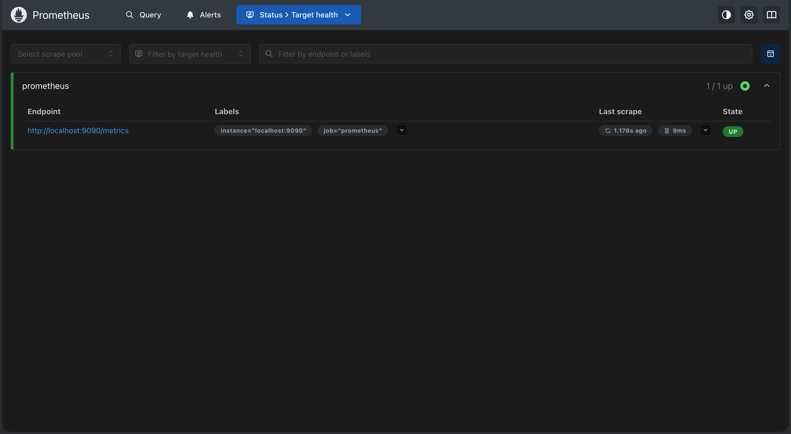
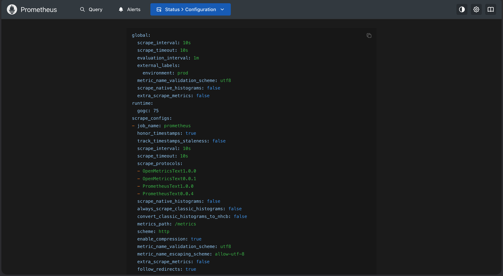

# Observabilité avec Prometheus, Graphana et Thanos

# Exercice01

## Objectif

Lancer un seul conteneur Prometheus, accéder à l'interface web sur le port 9090 et vérifier que Prometheus se scrape lui-même.

Prérequis
•	Un runtime de conteneurs fonctionnel
•	Le port 9090 libre sur votre poste

#Étapes

1.	Récupérer l'image : docker pull prom/prometheus:latest

````
docker pull prom/prometheus:main-distroless
````

2.	La lancer : docker run -d --name prometheus -p 9090:9090 prom/prometheus:latest

```
docker run -d --name prometheus -p 9090:9090 prom/prometheus:main-distroless
```

3.	Ouvrir http://localhost:9090 dans votre navigateur



4.	Aller dans **Status > Targets** et confirmer que la cible prometheus est UP



5.	Exécuter docker logs prometheus et lire la ligne de démarrage qui annonce le répertoire de stockage

Lancement de la commande : 

```
docker logs prometheus
```

Dans les logs, on peut apercevoir le chargement du fichier de configuration :


```
time=2026-04-27T09:21:49.817Z level=INFO source=main.go:1650 msg="Loading configuration file" filename=/etc/prometheus/prometheus.yml

time=2026-04-27T09:21:49.817Z level=INFO source=main.go:1689 msg="Completed loading of configuration file" db_storage=12.042µs remote_storage=916ns web_handler=208ns query_engine=542ns scrape=93.291µs scrape_sd=7.875µs notify=52.292µs notify_sd=2.875µs rules=917ns tracing=1.709µs filename=/etc/prometheus/prometheus.yml totalDuration=306.125µs
```

# Exercice 2 : Écrire votre premier prometheus.yml

## Objectif

Remplacer la configuration par défaut par votre propre prometheus.yml. Définir un intervalle de scrape global de 10s, un external label environment=lab, et recharger Prometheus sans le redémarrer.

Prérequis

•	Exercice 1 terminé

## Étapes

6.	Arrêter le conteneur précédent : docker rm -f prometheus

````
docker rm -f prometheus
````

7.	Créer un fichier prometheus.yml sur l'hôte avec les paramètres demandés

```
global:
  scrape_interval: 10s  # Intervalle de scraping par défaut
  external_labels:
    environment: 'prod' 

scrape_configs:
  - job_name: 'prometheus'
    static_configs:
      - targets: ['localhost:9090']

```

8.	Lancer un nouveau conteneur avec --web.enable-lifecycle et le fichier monté sur /etc/prometheus/prometheus.yml

```
version: '3.8'

services:
  prometheus:
    image: prom/prometheus:main-distroless
    container_name: prometheus
    ports:
      - "9090:9090"
    volumes:
      - ./prometheus.yaml:/etc/prometheus/prometheus.yml
    command:
      - '--web.enable-lifecycle'
      - '--config.file=/etc/prometheus/prometheus.yml'
````


9.	Modifier le fichier puis déclencher un rechargement : curl -X POST http://localhost:9090/-/reload

```
curl -X POST http://localhost:9090/-/reload
```

10.	Confirmer la modification dans Status > Configuration



Indices
•	external_labels se place sous le bloc global:.
•	Sans --web.enable-lifecycle, l'endpoint /-/reload renvoie 405.

# Exercice 3 : Ajouter node_exporter et scraper les métriques système

## Objectif

Lancer node_exporter et configurer Prometheus pour le scraper. Vérifier que la métrique node_cpu_seconds_total apparaît dans l'expression browser.

## Prérequis

•	Un Prometheus en cours d'exécution issu des exercices précédents

Étapes
11.	Lancer node_exporter : docker run -d --name node-exporter -p 9100:9100 prom/node-exporter:latest

```
docker run -d --name node-exporter -p 9100:9100 prom/node-exporter:master-distroless
```


12.	Ajouter un nouveau job nommé 'node' dans prometheus.yml pointant vers host.docker.internal:9100 (Mac/Windows) ou l'IP du conteneur (Linux)

````
  - job_name: 'node'
    static_configs:
      - targets: ['node_exporter:9100']
````

13.	Déclencher un rechargement (ou recréer le conteneur) puis confirmer que la cible est UP

````
docker-compose down
````

14.	Exécuter la requête : node_cpu_seconds_total dans l'expression browser


Indices
•	Un DaemonSet garantit un pod node-exporter par nœud.
•	Sans relabeling, Prometheus essaie de scraper le port du kubelet au lieu de 9100.

